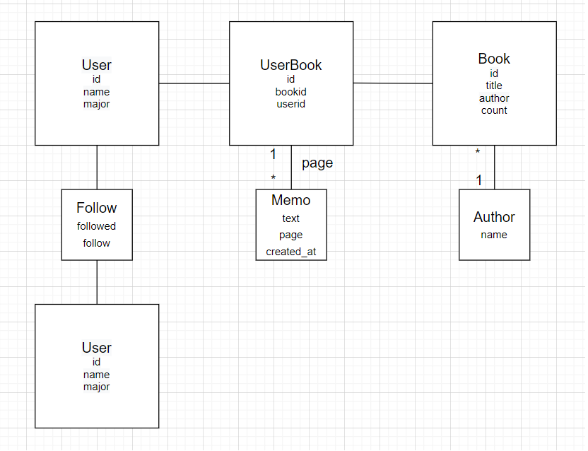

# Let's Read (duty free)

  

## 개요

  

(그려본 책장 이미지)  

>__메인 페이지__

  

>  >자신의 책장이 가장 먼저 뜨고 책장에는 사용자가 저장해놓은 책들이 꽂혀있다.

  

>  >책을 클릭하면 내가 남겼던 메모, 페이지 확인 가능

  

>__추천 페이지__

  

>  >다음에 읽을 만한 책들의 리스트가 나와 있는 페이지

  

>__친구 페이지__

  

>  >친구들의 책장으로 이동 가능

  

* * *

  

## 기능

  

1. 웹 상의 책꽂이에 __책등이 보이도록 책을 꽂을 수__ 있다.

  

	* 페이지 수에 비례한 두께로 책장이 채워짐

  

2. 책마다 __메모__ 를 남길 수 있다.

  

	* 메모를 남긴 날짜, 페이지 기록 가능

  

3.  __읽을 책을 추천__ 해준다.

  

	* 같은 책을 읽은 다른 사람들이 읽은 다른 책 추천

  

	* 내가 읽은 책의 작가들의 다른 책 추천

  

4.  __누적 독서량__ 측정

  

	* 책갈피처럼 어디까지 책을 읽었는지 표시할 수 있도록 하여 1년 혹은 한 달 단위로 누적 독서량(페이지 기준)을 표시

  

5.  __친구의 책장__ 구경

  

	* 친구끼리 서로 책장, 누적 독서량 등 확인 가능(메모 확인 불가능)

  

6. 링크를 통해 __서평__ 을 읽을 수 있는 사이트 연결

  

	* 다른 사람들이 쓴 서평, 전문 비평가들이 쓴 서평 모두 가능
	
* 매력
	* 실제 책장에 책을 꽂는 것 같은 감성
	* 내가 직접 기록을 남길 수 있는 메모
	* 기억은 컴퓨터에게 맡기는 간편함  

* * *
## 시장조사

##### 책과 관련한 비슷한 서비스는 현재 존재하지 않는다.     DayGram, 1 Second Eeveryday 등 매일 짧은 메모를 일기처럼 남기는 프로그램은 현재 시장에 많이 있다.    github와 2020년 2월 집중유형 테스트로 마케팅한 앱 'Forest' 등이 공략한 '하루하루를 기록 (daily record)'하는 방식을 차용

##### 본질적 한계점: 현대인들이 책을 많이 읽지 않는다.

##  페르소나& 유저 시나리오

### 경험 목표

##### * 공통: 책을 읽으며 자기발전과 함께 여가 시간을 알차게 보냈다는 보람을 느끼는 것

### 사용목표

##### * 자신의 독서생활을 기록하며 독서량을 늘려나가고 싶은 사용자

##### * 읽은 책의 내용을 쉽게 다시 확인하고 책을 읽을 때 자신의 생각을 복기하고 싶은 사용자

##### * 자신이 선호하는 장르에 따라 책을 추천받고 때로는 새로운 분야의 책을 추천받고 싶은 사용자

##### * 친구들과 함께 독서 챌린지를 하면서 자극받으며 독서량을 늘리고 싶은 사용자

<table border="0">
	<tr>
		<th>User</th>
		<th>profile</th>
		<th>behavior</th>
		<th>needs</th>
	</tr>
	<tr>
		<td>A</td>
		<td><h5>퇴근 후, 주말에만 여가시간이 있는 직장인 </h5></td>
		<td><h5>1. 독서에 기본적으로 투자할 수 있는 시간이 많지 않고 큰 목표 없이 프로그램을 사용한다.  2. 퇴근 후 누워 tv, 핸드폰만 보는 삶에 지쳐있다. </h5></td>
		<td> <h5>1.  책 한 권을 읽는 데 시간이 오래 걸리므로 읽은 부분의 내용에 대한 기록이  중간중간 필요하다.  2. 시간이 부족하므로 책을 추천받아야 한다.</h5></td>
</table>

#### 유저 시나리오

*  독서에 대한 의지가 충만한 상태로 프로그램을 설치한다.
* 귀찮아서 미루기도 하며 일주일 평균 100페이지를 읽기 힘들다.
* 매번 몇 페이지까지 읽었는지, 내용은 무엇인지, 자신은 어떤 생각을 했는지를 기록하는 순간은 매우 알차다. 누적독서량이 조금씩 쌓일 때 보람을 느낀다.
* 읽던 책에 싫증을 느껴 다른 책을 찾고 싶은데 어떤 책을 검색해야 할지 모르겠다.
* 추천 페이지에서 책을 추천받아 읽는다.

<table border="0">
	<tr>
		<th>User</th>
		<th>profile</th>
		<th>behavior</th>
		<th>needs</th>
	</tr>
	<tr>
		<td>B</td>
		<td><h5> 여가시간이 방학처럼 연중 특정 시기에 몰려있는 대학생 </h5></td>
		<td><h5>1. 자기계발에 관심이 많고 진로 등의 이유로 공부의 목적으로 독서를 대하는 경우가 많다.   2. 친구들의 기록에 다른 유저들에 비해 민감하다.   3. 프로그램의 감성적인 면이 사용여부에 큰 영향을 미친다. </h5></td>
		<td> <h5>1.  여름방학 때 읽던 책을 겨울방학에 펴기도 하므로 책 내용에 대한 기록이 필요하다.  2. 프로그램의 디자인이 중요하다.   3. 새로운 분야에 대한 호기심으로 새로운 주제의 책이 필요하다.  4. 다른 사람들에게 보이지 않도록 하는 기능이 필요하다.</h5></td>
</table>

#### 유저 시나리오

* 독서에 대한 의지가 충만한 상태로 프로그램을 설치한다.
* 사놓은 책들을 모두 프로그램 책꽂이 꽂는다.
* 매번 몇 페이지까지 읽었는지, 내용은 무엇인지, 자신은 어떤 생각을 했는지를 기록하는 순간은 매우 알차다. 누적독서량이 조금씩 쌓일 때 보람을 느낀다.
* 익숙한 주제에 싫증을 느껴 다른 책을 찾고 싶은데 어떤 책을 검색해야 할지 모르겠다.
* 친구의 책장에 놀러가서 다른 친구들은 어떤 책을 읽는지 본다.
* 내 책장의 디자인 테마를 바꿔본다.
* 친구들과 독서량 목표를 설정하고 같이 읽는다.

