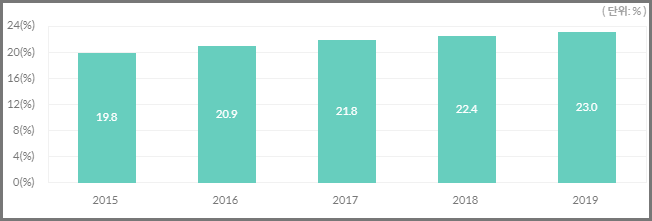

# 달밤
___
1. 서비스 개요
- 대학교 기숙사 커뮤니티를 조성함으로써 쾌적한 기숙사 환경을 조성하고, 삶의 질을 향상시킨다.

    1. 서비스 배경
        1. 기숙사에서 발생하는 문제점
            - 방음시설 미흡으로 인한 방 간의 소음 문제
            - 좁은 공간에 다수의 인원이 배정되는 다인실 구조로부터 발생하는 룸메이트 간 갈등
            - 시설의 노후화로 인해 발생하는 도난, 벌레·곰팡이와 같은 청결 문제, 악취, 누수, 공용기기 고장 등의 문제 발생
            - 통금 및 냉난방 시간, 식당 및 매점 등 편의시설 이용, CCTV 설치와 관련하여 기숙사 생들과 대학 간의 의견 불일치로 인해 발생하는 문제
  
        1. 기숙사 관련 문제 해결을 위한 소통의 한계
            - 대학과 기숙사 생들의 1:n 의사소통(관악사 홈페이지, 시설수리 전담 카카오톡 채널, 동별 조교의 카카오톡 채널)에 치우친 구조
            - 문제 해결 및 소통의 제한적인 시간
            - 기숙사 생들 간에 발생하는 갈등 중재의 어려움
            - 정보의 다양성 및 유동성 감소에 따른 문제 해결의 효율성 저하

        1. 부가적인 기대효과
            - 기숙사 생들 간의 인적, 물적 및 정보 자원 공유를 통해 누릴 수 있는 기대효과를 보기 어려움

        1. 기숙사 인원 증가
            - ‘대학생 기숙사 수용인원을 5만명까지 확충할 것’이라는 정부 과제 아래에 대학 정원 대비 기숙사 수용 인원은 매년 늘어나는 추세(그림 1)
             
            |년도|수용 인원(명)|비율(%)|
            |:----------:|:----------:|:----------:|
            |2017|361,100|21.8|
            |2018|368,700|22.4|
            |2019|374,400|23.0|
  
    1. 서비스 목적
        - m:n 의사소통 구조를 취하는 커뮤니티 개설을 통해 쌍방향의 24시간 실시간 의사소통을 실현한다.
        - 상호 간에 발생하는 개인적인 문제들의 자발적인 해결을 도모한다.
        - 다양한 참여자들 간의 보다 신속한 피드백 제공을 통해 사소한 문제들에 대한 효율적인 해결을 통해 대학 측의 불필요한 행정력 소모를 막는다.
        - 기숙사 전반에 걸친 문제에 대하여 대규모 여론을 형성하여 대학 측에 의견을 수렴하도록 함으로써 기숙사 환경을 개선한다.
        - 기숙사 내부 입점 브랜드 및 외부 브랜드와의 제휴를 통해 부가적인 혜택을 제공한다.
        - 인적, 물적 및 정보 자원 공유를 통해 삶의 질을 향상시킨다.

    1. 서비스 주요 기능
        - 물품 보관/대여/거래/공구
        - 기숙사 전체 및 각 동의 불만사항/문의사항/개선사항 공유
        - 기숙사 생활 관련 질문 및 답변
        - 서비스 이용자간의 쪽지 보내기 기능
        - 취미활동 및 스터디 등 모임 모집
        - 기숙사 내부 및 외부 업체들과의 제휴를 통한 혜택 제공
        
___

2. 환경분석
    1. 시장분석
        1. 에브리타임  
            - 국내 1위 대학생 서비스. 446만명의 대학생 가입자 보유
            - 다양한 게시판을 통해 서비스를 제공.
            - 기숙사 게시판이 따로 존재하지만, 하루 평균 1~3 개의 게시글이 업로드 되는 것에 그치며 활성화가 이루어지지 않음.
            - 타 게시판에 존재하는 관악사 관련 글은 접근성이 상당히 떨어지고, 주 이야깃거리에서 벗어남.
  
        1. 대학별 기숙사 홈페이지
            - 1:n 의사소통 구조
            - 정보의 활용성이 떨어짐.
            - 찾고자 하는 정보에 대한 접근성이 떨어짐.

        1. 대학별 기숙사 자치회 홈페이지(페이스북)
            - 기숙사와 관련된 행사 기획 및 실시
            - 기숙사 자치회 측의 일방적인 게시글 게재.
            - 기숙사 학생들은 댓글/채팅으로만 소통 가능.
            - 대학별로 자치회 홈페이지가 따로 없는 경우도 존재

        1. 대학별 기숙사 카카오톡 채널
            - 각 동 카카오톡 채널을 통해 동 조교에게 문의사항/건의사항/불만사항 접수 가능. 실명으로 가능. 시간 소요. 복잡.
            - 시설수리 카카오톡 채널을 통해 시설 수리. 간단한 문제 해결이 가능한 경우에도 행정력 소모.

    1. 차별화
        - 기숙사에 거주하는 학생들에 필요한 맞춤형 서비스 제공
        - 기숙사와 접점을 크게 갖는 서비스 이용자들
        - 기숙사와 높은 수준으로 관련된 정보의 제공 및 공유
        - 익명과 실명을 모두 활용한 의사소통의 효율성 제고
        - 신속한 문제해결과 자율성 강화
        
___

3. UX 시나리오

    1. 페르소나 설정
        - 기숙사에 거주 중인 대학생/대학원생(1순위)
        - 기숙사 입주 예정인 대학생/대학원생
        - 기숙사에 거주 중이거나, 입주할 예정이 없는 해당 학교 소속의 대학생/대학원생
        - 기숙사 관리인(직원)
        - 기숙사 입점 브랜드 및 외부 제휴 브랜드
        
    1. 1순위 페르소나 시나리오(기숙사에 거주 중인 대학생/대학원생)
        | 시나리오 | 니즈 | 사용자 행동 | 기능 |  
        |:-----------:|:-----------:|:-----------:|:-----------:|
        |- 옆 방 사람이 떠드는 소리 때문에 잠이 안 와. - 사람들이 휴게실을 너무 더럽게 사용하는 것 같아. - 매점 앞에서 떠드는 사람 때문에 집중이 안돼. - 흡연구역에 가기 전부터 불을 붙이는 사람 때문에 힘들어. |소음/청결문제 등 사생들간의 문제를 완화 및 해결하고 싶다.|익명/실명을 통해서 발생한 상황에 대한 정보(날짜, 시간 및 내용 등)를 게시하여 사생들의 공감을 얻고 문제를 공유한다.|- 실명 가입 기능 - 익명/실명 선택 기능 - 글/댓글 게시 기능 - 게시글 공감/비공감 기능 - 기숙사 전체 및 동별 게시판 개설(문제 해결 목적)|
        |누군가가 나를 오해하고, 특정 게시글을 통해 맹목적으로 비난하는데 상당히 불쾌해.|특정인을 맹목적으로 비난하고, 불쾌감을 조성할 수 있는 글을 보고 싶지 않다.|해당 게시글을 신고하고, 블라인드 처리를 요구한다. 또한, 해당 게시글을 작성한 작성자에 대한 제재를 요구한다.|- 게시글 신고 기능 - 게시글 블라인드 기능 - 계정 신고 누적 기능 - 특정 명의의 계정 패널티 기능 - 특정 명의의 계정 영구제명 기능|
        |기숙사 편의시설을 이용하고 싶은데 위치가 어디고, 이용시간은 어떻게 되는거지.|편의시설 이용과 관련된 정보를 빠르게 습득하고, 한눈에 보고 싶다.|기숙사 map과 관련 TIP 툴을 통해 정보를 얻는다.|-기숙사 map 제공 - map에 연결된 Tip 툴 제공 - Tip 툴 수정 기능(자율적)|
        |기숙사 생활의 퀄리티를 좀 더 향상시키고 싶은데, 다른 기숙사 생들은 어떤 생활을 하고 있을까.|기숙사 생활에서 몰랐던 생활 꿀팁을 얻고 싶다.|기숙사 생활 꿀팁들을 모아놓은 글을 읽는다.| - 게시글 추천/비추천 기능 - 특정 수 이상의 추천 글 별도 노출 및 게시 기능|
        |세제, 휴지 같은 공용 물품을 인터넷에서 저렴하게 구매하고 싶어.|물품을 공구하여 택배비를 절약하고 싶다.|공구 게시판을 통해 함께 구매할 사람을 찾는다.| - 공구 게시판 - 본인/동호수 인증 기능|
        |공학용 계산기를 하루만 빌리고 싶어.|물품을 대여하고 싶다.|대여 게시판을 통해 물품을 대여한다.|- 대여 게시판 - 본인 신용 정보 기능(당근마켓 온도) - 본인/동호수 인증 기능|
        |내가 사용하던 마우스를 판매하고 싶어.|물품을 판매하고 싶다.|중고거래 게시판을 통해 물품을 판매한다.|- 중고거래 게시판 - 본인 신용 정보 기능(당근마켓 온도) - 본인/동호수 인증 기능|
        |방학기간 동안 짐을 잠깐 맡기고 싶어.|물품을 기숙사에 보관하고 싶다.|보관 게시판을 통해 물품을 보관한다.|- 보관 게시판 - 본인 신용 정보 기능(당근마켓 온도) - 본인/동호수 인증 기능|
        |- 기숙사 풋살장에서 같이 풋살을 할 사람 없을까. - 방학기간 동안에 기숙사에서 같이 유기화학을 공부해볼 사람은 없을까.|취미활동을 같이할 사람을 찾거나 스터디를 모집하고 싶다.|취미활동 공유/스터디 모집 게시판을 통해 사람을 구한다.|취미활동 공유/스터디 모집 게시판|
        |기숙사 라디에이터 주변으로 정리가 너무 어려운데 이건 기숙사 관리 측에서 꼭 고쳐줬으면 좋겠어.|기숙사 관리 측에서 꼭 인지했으면 하는 사항을 건의하고 싶다.|기숙사 건의 게시판을 통해 요구사항을 건의한다.|- 건의 게시판 - 기숙사 관리인 인증 기능|
        |기숙사에 있는 올리브 그린/치킨집/샌드위치 집에서 할인받을 수 있는 방법은 없을까.|기숙사 입점 브랜드에서 할인을 받고 싶다.|제휴 브랜드 쿠폰함을 통해 할인쿠폰을 다운 받아 할인받는다.|- 쿠폰 다운 기능 - 배너 기능 - 포인트 적립 및 사용 기능|
